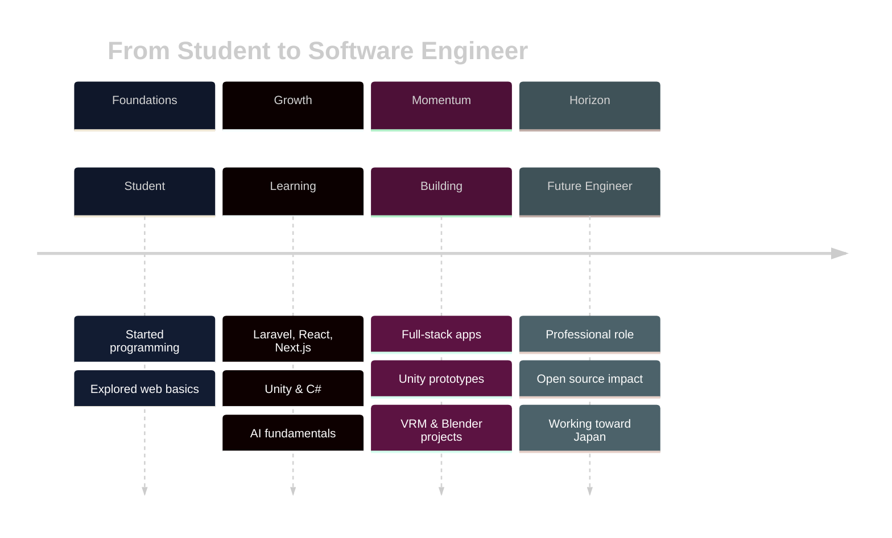
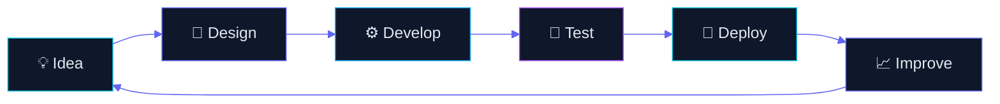
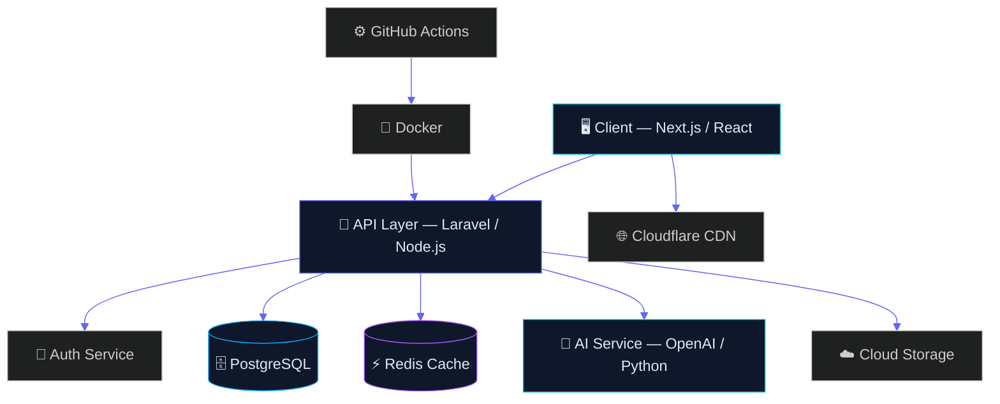
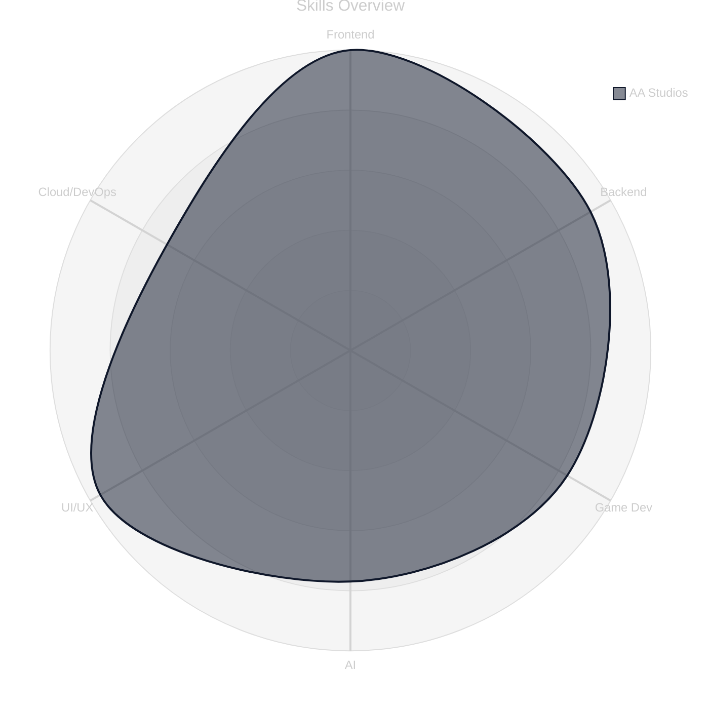

<div align="center">


<br/>

<a href="https://git.io/typing-svg">
  
</a>

<br/><br/>


</div>

<br/>

<div align="center">

### 「 formerly known as **Quincy Dev** 」

*A design studio for code, games, and ideas — based in* 🇮🇩 *Indonesia, dreaming in* 🇯🇵 *Japan.*

</div>

<br/>


<br/>

## 🪞 About Me

<table align="center">
<tr>
<td width="55%" valign="top">

```yaml
brand:
  name: "AA Studios"
  formerly: "Quincy Dev"

profile:
  role: "Software Engineering Student"
  country: "Indonesia 🇮🇩"
  dream_country: "Japan 🇯🇵"
  dream_career: "Professional Software Engineer"

focus:
  - Full Stack Web Development
  - Unity Game Development
  - Artificial Intelligence
  - UI/UX Design
  - Blender & 3D Art
  - VRM Character Design
  - Open Source

currently_learning:
  - Laravel · Next.js · React
  - TypeScript · Node.js
  - Unity · C#
  - Blender
  - PostgreSQL · Docker
  - Cloud Deployment
  - AI Engineering

currently_working_on: "A VRM-based anime character + Unity mini-game"
passion: "Turning ideas into elegant, working software"
fun_fact: "Codes best at 2AM with lo-fi anime OSTs playing"
```

</td>
<td width="45%" valign="top" align="center">


<br/>

> *"Design is intelligence made visible.  
> Code is intention made real."*

</td>
</tr>
</table>

<br/>


<br/>

## 🧩 Tech Stack

<div align="center">

**Programming Languages**
<br/>


<br/><br/>

**Frontend**
<br/>


<br/><br/>

**Backend**
<br/>


<br/><br/>

**Databases**
<br/>


<br/><br/>

**Game Development**
<br/>


<br/><br/>

**AI**
<br/>


<br/><br/>

**Cloud & DevOps**
<br/>


<br/><br/>

**Tools · Editors · Design**
<br/>


<br/><br/>

**Operating Systems**
<br/>


</div>

<br/>


<br/>

## 📊 GitHub Analytics

<div align="center">


<br/>


<br/><br/>


<br/><br/>


</div>

<br/>


<br/>

## 🚀 Current Projects

<div align="center">

| Project | Category | Status | Stack |
|:--|:--:|:--:|:--|
| 🏗️ **Portfolio Website** | Web | 🟢 Active | Next.js · Tailwind · TypeScript |
| 🌾 **Laravel SaaS Starter** | Web | 🟡 In Progress | Laravel · PostgreSQL · Docker |
| 🎮 **Unity Adventure Game** | Game Dev | 🟢 Active | Unity · C# |
| 🧠 **AI Study Companion** | AI | 🟡 In Progress | Python · OpenAI API |
| 👘 **Original VRM Character** | 3D / Design | 🟢 Active | Blender · VRoid · VRM |
| 🌐 **Open Source Contributions** | OSS | 🔵 Ongoing | Various |

</div>

<br/>


<br/>

## ⚙️ Featured Technologies

<div align="center">


</div>

<br/>


<br/>

## 🗺️ Learning Roadmap

<details open>
<summary><b>📍 Current</b></summary>
<br/>

- [x] Laravel — building real backend APIs
- [x] Next.js + TypeScript — modern frontend architecture
- [x] Unity + C# — core game mechanics
- [ ] PostgreSQL — advanced querying & indexing

</details>

<details>
<summary><b>➡️ Next</b></summary>
<br/>

- [ ] Docker & container orchestration
- [ ] Cloud deployment (AWS / GCP)
- [ ] AI Engineering fundamentals
- [ ] Advanced Blender character rigging

</details>

<details>
<summary><b>🔮 Future</b></summary>
<br/>

- [ ] System design at scale
- [ ] Procedural generation in Unity
- [ ] Computer vision pipelines
- [ ] Publish an original indie game

</details>

<br/>


<br/>

## 🎯 Goals

<table align="center">
<tr>
<th>🗓️ 2026</th>
<th>🗓️ 2027</th>
</tr>
<tr>
<td valign="top">

- Ship a full-stack Laravel + Next.js SaaS
- Release a Unity game demo
- Deepen AI engineering skills
- Publish original VRM character

</td>
<td valign="top">

- Land a Software Engineering role
- Contribute to major open-source projects
- Build an indie game studio side-project
- Move toward working in Japan 🇯🇵

</td>
</tr>
</table>

<div align="center">

`Career` → Professional Software Engineer  
`Open Source` → 20+ meaningful contributions  
`Game Dev` → Ship 1 complete indie title  
`AI` → Build & deploy 3 production AI tools

</div>

<br/>


<br/>

## ⏳ Timeline



<br/>


<br/>

## 🧭 Coding Philosophy

<div align="center">

> *"Simplicity is the ultimate sophistication.  
> Every line of code should earn its place."*

**— AA Studios**

</div>

<br/>


<br/>

## 🔄 Development Workflow



<br/>


<br/>

## 🏛️ Project Architecture



<br/>


<br/>

## 🕸️ Skills Radar



<br/>


<br/>

## 🎐 Fun Facts

<div align="center">

| | |
|:--|:--|
| 🎬 **Anime** | Always has a series running in the background |
| 🎧 **Music** | Lo-fi, synthwave & anime OSTs on repeat |
| 🎮 **Gaming** | Loves RPGs and indie titles for design inspiration |
| 🗣️ **Languages** | Learning Japanese 🇯🇵 alongside code |
| ☕ **Coffee** | Fuel for every build session |
| 🌙 **Night Coding** | Most productive after midnight |
| 🖥️ **Desk Setup** | Minimal, clean, distraction-free |

</div>

<br/>


<br/>

## 🎵 Music While Coding

<div align="center">

- 🌌 Lo-fi Hip Hop Radio
- 🎹 Synthwave / Retrowave
- 🎻 Anime OST Piano Covers
- 🌃 City Pop Classics
- 🎸 Ambient Instrumental

</div>

<br/>


<br/>

## 🧳 Workspace

<div align="center">

| Category | Setup |
|:--|:--|
| 💻 **Laptop** | Custom-built dev machine |
| 🧠 **IDE** | VS Code / JetBrains Rider |
| 🌿 **Version Control** | Git + GitHub |
| 🌐 **Browser** | Arc Browser |
| ⌨️ **Terminal** | Windows Terminal + Oh My Posh |

</div>

<br/>


<br/>

## 🔬 Currently Exploring

<div align="center">


</div>

<br/>


<br/>

## 🌱 Open Source

<div align="center">

🎯 **Contribution Goals**

- Contribute to 10+ open-source repositories
- Maintain at least one public tool or library
- Help improve documentation for tools I use daily
- Mentor beginners through issues & PRs

</div>

<br/>


<br/>

## 📬 Contact

<div align="center">

<a href="https://github.com/username"></a>
<a href="mailto:youremail@example.com"></a>
<a href="https://linkedin.com/in/yourprofile"></a>
<a href="https://discord.com/users/yourid"></a>
<a href="https://yourportfolio.com"></a>

</div>

<br/>


<br/>

## ☕ Support

<div align="center">

<a href="https://www.buymeacoffee.com/username">
  
</a>

*If my work inspired you, a coffee keeps the night sessions going.*

</div>

<br/>


<br/>

<div align="center">

## 💬 Quote

> *"The future belongs to those who build it — one commit at a time."*

</div>

<br/>

<div align="center">

### ✨ Thank you for visiting my profile ✨

*Dream. Build. Improve.*


</div>
